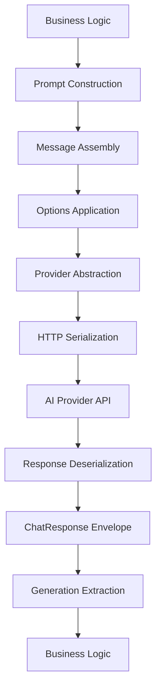

# Spring AI Architecture Analysis: Why and How

## 🎯 Philosophical Foundation

Spring AI represents a fundamental shift in how enterprise Java applications integrate with AI services. This document explores the **why** behind design decisions, the intrinsic connections between components, and the architectural patterns that make Spring AI both powerful and pragmatic.

## 🏗️ Core Architectural Principles

### 1. The Abstraction Philosophy

**Why Abstract AI Providers?**

Spring AI follows the same abstraction principle that made Spring successful with databases (JDBC), messaging (JMS), and caching. The core insight: **AI providers should be pluggable infrastructure, not architectural decisions**.

```java
// Why this works: Provider-agnostic interface
public interface ChatModel {
    ChatResponse call(Prompt prompt);
    Flux<ChatResponse> stream(Prompt prompt);
}

// Instead of tightly coupled implementations
OpenAiChatClient openAi = new OpenAiChatClient();  // ❌ Vendor lock-in
AnthropicClient anthropic = new AnthropicClient(); // ❌ Different APIs
```

**The Hidden Connection**: This abstraction allows **business logic to remain stable** while AI technology evolves rapidly. Your prompt engineering, response processing, and error handling remain consistent regardless of whether you switch from OpenAI to Anthropic to Mistral.

### 2. The Prompt as First-Class Citizen

**Why Prompt is a Domain Object?**

```java
public class Prompt {
    private List<Message> instructions;
    private ChatOptions chatOptions;
}
```

Traditional approach treats prompts as strings. Spring AI elevates prompts to **structured domain objects** because:

1. **Composability**: Messages can be combined, templated, and reused
2. **Type Safety**: Different message types (System, User, Assistant) have distinct semantics
3. **Metadata Preservation**: Context, options, and history travel with the prompt
4. **Testing**: Prompts become testable artifacts

**Intrinsic Connection**: `Prompt` → `Message` → `ChatOptions` form a **semantic triple** that captures intent, content, and execution preferences in a single, immutable structure.

### 3. The Response Envelope Pattern

**Why Wrap AI Responses?**

```java
public class ChatResponse {
    private List<Generation> results;
    private ChatResponseMetadata metadata;
}

public class Generation {
    private AssistantMessage output;
    private ChatGenerationMetadata generationMetadata;
}
```

AI responses aren't just content—they're **computational artifacts** with metadata, alternatives, and provenance. The envelope pattern preserves this richness while allowing simple access patterns.

**Hidden Insight**: The `ChatResponse` → `Generation` → `AssistantMessage` hierarchy mirrors the **uncertainty inherent in AI**—multiple possible outputs, confidence levels, and generation metadata.

## 🔄 The Request-Response Lifecycle

### The Journey of a Prompt



**Why This Flow Matters**:
- **Separation of Concerns**: Each step has a single responsibility
- **Interceptability**: Any step can be intercepted for logging, caching, or modification
- **Testability**: Each layer can be tested independently
- **Observability**: Rich metadata flows through the entire pipeline

### The Template Engine Integration

**Why Spring Template Engine?**

```java
@Component
public class PromptTemplateService {
    
    @Value("classpath:/prompts/analyze-sentiment.st")
    private Resource promptTemplate;
    
    public Prompt createAnalysisPrompt(String text, String context) {
        var template = new PromptTemplate(promptTemplate);
        return template.create(Map.of(
            "text", text,
            "context", context,
            "format", "JSON"
        ));
    }
}
```

**The Deep Why**: Templates solve the **prompt engineering complexity problem**. Raw string concatenation leads to:
- Injection vulnerabilities
- Inconsistent formatting
- Poor maintainability
- No version control for prompts

**Intrinsic Connection**: Templates bridge the gap between **static prompt engineering** and **dynamic runtime requirements**. They're the **parameterized query equivalent** for AI interactions.

## 🎛️ Configuration Philosophy

### The Options Hierarchy

**Why Nested Configuration?**

```java
// Global defaults
@ConfigurationProperties("spring.ai.openai.chat.options")
public class OpenAiChatOptions {
    private String model = "gpt-3.5-turbo";
    private Double temperature = 0.7;
}

// Runtime overrides
var response = chatModel.call(new Prompt(message, 
    ChatOptions.builder()
        .temperature(0.1)  // Override for this specific call
        .build()));
```

**The Philosophy**: Configuration should follow the **principle of least surprise** with **progressive override capability**:

1. **Sensible Defaults**: Work out of the box
2. **Application-Level**: Override for your domain
3. **Request-Level**: Override for specific interactions

**Hidden Connection**: This mirrors Spring's property resolution hierarchy—**consistent mental model** across the framework.

### The Provider SPI (Service Provider Interface)

**Why SPI Pattern?**

```java
// Provider implementations are discovered, not hardcoded
public interface ChatModel {
    // Contract all providers must implement
}

@Component
public class OpenAiChatModel implements ChatModel { /* */ }

@Component  
public class AnthropicChatModel implements ChatModel { /* */ }
```

**The Strategic Why**: SPI enables **ecosystem extensibility** without framework modification. New AI providers can integrate by implementing interfaces, not by forking code.

## 🔗 The Type System Design

### Message Type Hierarchy

**Why Different Message Types?**

```java
public abstract class Message {
    protected String content;
    protected Map<String, Object> metadata;
}

public class SystemMessage extends Message {
    // Establishes AI behavior and constraints
}

public class UserMessage extends Message {
    // Represents human input
}

public class AssistantMessage extends Message {
    // Captures AI responses for conversation history
}
```

**The Semantic Why**: Different message types have **different semantic roles** in AI conversations:

- **SystemMessage**: Establishes the **conversational contract**
- **UserMessage**: Represents **human intent**
- **AssistantMessage**: Captures **AI reasoning** for context

**Intrinsic Connection**: This type system enables **conversation state management** and **context preservation** across multiple interactions.

### The Streaming Architecture

**Why Reactive Streams?**

```java
public interface StreamingChatModel extends ChatModel {
    Flux<ChatResponse> stream(Prompt prompt);
}
```

**The Performance Why**: AI responses can be **incrementally generated**. Reactive streams provide:

1. **Backpressure Handling**: Don't overwhelm consumers
2. **Cancellation**: Stop expensive operations early
3. **Composition**: Chain operations on streaming data
4. **Non-blocking**: Maintain application responsiveness

**Hidden Insight**: Streaming isn't just about performance—it enables **progressive disclosure** of AI reasoning, making applications feel more responsive and intelligent.

## 🎨 The JSON Schema Integration

### From Strings to Structures

**Why BeanOutputConverter?**

```java
// Traditional approach: Parse strings manually
String jsonResponse = ai.generate("Create a user profile");
ObjectMapper mapper = new ObjectMapper();
UserProfile profile = mapper.readValue(jsonResponse, UserProfile.class); // ❌ Error-prone

// Spring AI approach: Declarative conversion
var converter = new BeanOutputConverter<>(UserProfile.class);
UserProfile profile = converter.convert(response.getResult().getOutput().getContent()); // ✅ Type-safe
```

**The Fundamental Why**: **AI outputs should integrate seamlessly with typed business logic**. String parsing creates impedance mismatches between AI and application layers.

**Intrinsic Connection**: `BeanOutputConverter` + JSON Schema generation creates a **type-safe bridge** between unstructured AI outputs and structured Java objects.

### The Schema Generation Philosophy

```java
public class GetCapitalResponse {
    @JsonPropertyDescription("The capital city name")
    private String capital;
    
    @JsonPropertyDescription("The country this capital belongs to")
    private String country;
}

// Spring AI automatically generates:
{
  "type": "object",
  "properties": {
    "capital": {
      "type": "string", 
      "description": "The capital city name"
    },
    "country": {
      "type": "string",
      "description": "The country this capital belongs to"
    }
  }
}
```

**The Design Philosophy**: **Code as single source of truth**. Schema derives from Java types, not vice versa. This ensures:
- **Refactoring Safety**: Changes propagate automatically
- **Documentation Freshness**: Descriptions stay current
- **Type Consistency**: No drift between schema and implementation

## 🔒 The Error Handling Strategy

### Retry and Circuit Breaker Integration

**Why Built-in Resilience?**

```java
@Configuration
public class AiResilienceConfig {
    
    @Bean
    public ChatModel resilientChatModel(ChatModel chatModel) {
        return ChatModel.builder()
            .chatModel(chatModel)
            .retryTemplate(retryTemplate()) // Automatic retries
            .circuitBreaker(circuitBreaker()) // Fail-fast when provider is down
            .build();
    }
}
```

**The Reliability Why**: AI services are **inherently unreliable**—rate limits, transient failures, and model updates create instability. Built-in resilience patterns ensure:

1. **Automatic Recovery**: Transient failures don't break user experience
2. **Cascading Failure Prevention**: Circuit breakers protect downstream systems
3. **Cost Control**: Exponential backoff prevents expensive retry storms

## 🚀 Performance and Cost Optimization

### The Caching Strategy

**Why Cache AI Responses?**

```java
@Service
public class CachedChatService {
    
    @Cacheable(value = "ai-responses", key = "#prompt.hashCode()")
    public ChatResponse getCachedResponse(Prompt prompt) {
        return chatModel.call(prompt);
    }
}
```

**The Economic Why**: AI calls are **expensive and slow**. Caching provides:
- **Cost Reduction**: Avoid redundant API calls
- **Performance**: Sub-millisecond response times for cached results
- **Availability**: Serve responses even when AI providers are down

**Intrinsic Connection**: `Prompt.hashCode()` creates **semantic deduplication**—identical prompts return cached results regardless of object identity.

### The Token Management Philosophy

**Why Token-Aware Design?**

```java
public class ChatOptions {
    private Integer maxTokens;        // Control output length
    private Integer maxPromptTokens;  // Control input processing
}
```

**The Cost-Control Why**: Tokens directly correlate to **cost and latency**. Explicit token management enables:
- **Budget Constraints**: Prevent runaway costs
- **Performance Tuning**: Balance quality vs. speed
- **Capacity Planning**: Predict infrastructure needs

## 🔄 Alternative Approaches and Trade-offs

### Why Not Direct HTTP Clients?

**Alternative**: Direct HTTP integration with WebClient/RestTemplate

```java
// Direct approach
WebClient webClient = WebClient.create("https://api.openai.com");
String response = webClient.post()
    .uri("/v1/chat/completions")
    .header("Authorization", "Bearer " + apiKey)
    .bodyValue(requestBody)
    .retrieve()
    .bodyToMono(String.class)
    .block();
```

**Trade-offs**:
- ✅ **More Control**: Full access to HTTP semantics
- ❌ **More Complexity**: Manual serialization, error handling, retries
- ❌ **Vendor Lock-in**: Different APIs for each provider
- ❌ **No Abstraction**: Business logic coupled to provider specifics

**Why Spring AI**: **Abstracts away HTTP complexity** while preserving configurability through low-level API access when needed.

### Why Not LangChain4j?

**Alternative**: LangChain4j for Java AI applications

**Trade-offs**:
- ✅ **Rich Ecosystem**: Many integrations and tools
- ✅ **AI-First Design**: Built specifically for AI workflows
- ❌ **Spring Integration**: Requires additional configuration for Spring
- ❌ **Learning Curve**: Different mental models from Spring
- ❌ **Maturity**: Newer, less enterprise adoption

**Why Spring AI**: **Natural Spring integration** with familiar patterns, mature ecosystem, and enterprise-ready features.

### Why Not OpenAI Java SDK?

**Alternative**: Provider-specific SDKs

**Trade-offs**:
- ✅ **Full Feature Access**: All provider-specific features
- ✅ **Direct Support**: Maintained by provider
- ❌ **Vendor Lock-in**: Different APIs for each provider
- ❌ **No Abstraction**: Can't switch providers easily
- ❌ **Integration Overhead**: Manual Spring configuration

**Why Spring AI**: **Provider abstraction** with escape hatches to provider-specific features when needed.

## 🎯 The Predictability Journey

### From Chaos to Control

**The Problem**: AI responses are **inherently non-deterministic**. The same prompt can produce different outputs, making testing and business logic challenging.

**Spring AI's Solution**: **Progressive Predictability**

1. **Prompt Templates**: Consistent structure reduces variability
2. **JSON Schema**: Constrains output format
3. **BeanOutputConverter**: Type-safe parsing
4. **Retry Logic**: Handles transient failures
5. **Caching**: Ensures identical inputs produce identical outputs

### The Prompt Engineering Pipeline

```java
// Stage 1: Template-based consistency
PromptTemplate template = new PromptTemplate(resource);
Prompt prompt = template.create(variables);

// Stage 2: Structured output
var converter = new BeanOutputConverter<>(ResponseClass.class);
String jsonSchema = converter.getJsonSchema();

// Stage 3: Enhanced prompt with format instructions
Prompt enhancedPrompt = new Prompt(
    prompt.getInstructions() + "\nRespond in this JSON format: " + jsonSchema
);

// Stage 4: Type-safe conversion
ChatResponse response = chatModel.call(enhancedPrompt);
ResponseClass typedResponse = converter.convert(response.getResult().getOutput().getContent());
```

**The Philosophy**: **Gradually constrain the solution space** until AI outputs become reliable business artifacts.

## 🔮 Future-Proofing Design

### The Extension Points

Spring AI is designed for **inevitable change** in the AI landscape:

1. **New Providers**: SPI pattern enables easy integration
2. **New Message Types**: Message hierarchy is extensible
3. **New Output Formats**: Converter pattern supports any target type
4. **New Protocols**: Transport abstraction allows non-HTTP providers

### The Metadata Strategy

**Why Rich Metadata?**

```java
public class ChatResponseMetadata {
    private String id;
    private String model;
    private Usage usage;           // Token consumption
    private String finishReason;   // Why generation stopped
    private Map<String, Object> metadata; // Provider-specific data
}
```

**The Future-Proofing Why**: AI capabilities evolve rapidly. Rich metadata ensures:
- **Observability**: Understanding AI behavior
- **Billing**: Accurate cost tracking
- **Optimization**: Performance tuning insights
- **Compliance**: Audit trails for AI decisions

## 📊 Summary: The Spring AI Mental Model

### Core Insight
Spring AI treats **AI as infrastructure**, not as application logic. Just as Spring abstracts databases, messaging, and web concerns, Spring AI abstracts AI providers while preserving the ability to access provider-specific features.

### The Value Proposition
1. **Consistent Patterns**: Familiar Spring concepts applied to AI
2. **Progressive Enhancement**: Start simple, add complexity as needed
3. **Provider Independence**: Switch AI providers without code changes
4. **Enterprise Ready**: Resilience, observability, and testing built-in
5. **Type Safety**: Structured outputs from unstructured AI responses

### The Architecture Philosophy
**"Make AI predictable enough for business logic, flexible enough for innovation, and reliable enough for production."**

This is achieved through:
- **Layered Abstraction**: Hide complexity, expose control
- **Gradual Typing**: From strings to structured objects
- **Composable Patterns**: Mix and match capabilities
- **Escape Hatches**: Access lower-level APIs when needed

Spring AI succeeds because it **respects both the chaotic nature of AI and the structured needs of enterprise software**, providing bridges between these worlds rather than forcing artificial constraints.